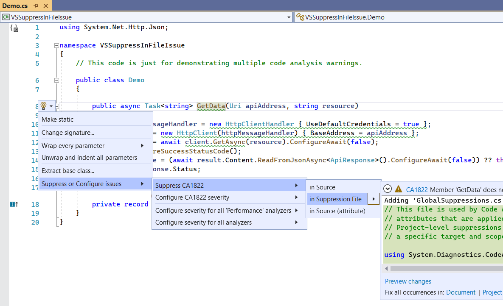
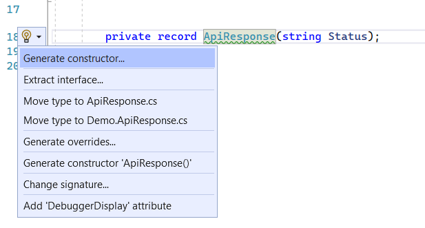
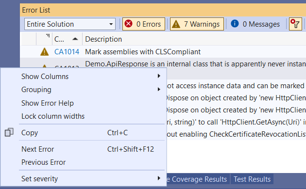

# VSSuppressInFileIssue

This repos contains sample code to demonstrate that in some cases it is not possible to suppress CA warnings in the Source or Suppression File.

Task: Try to suppress all warnings in the `GlobalSuppressions.cs` file. Most of the warnings cannot be suppressed via Visual Studio (tested with VS 2022 17.3.2).

### This screenshot shows how it should work

### This screenshot shows a warning which cannot be suppressed

### Suppression in Error List view worked in older Visual Studio versions. Doesn't work anymore.

